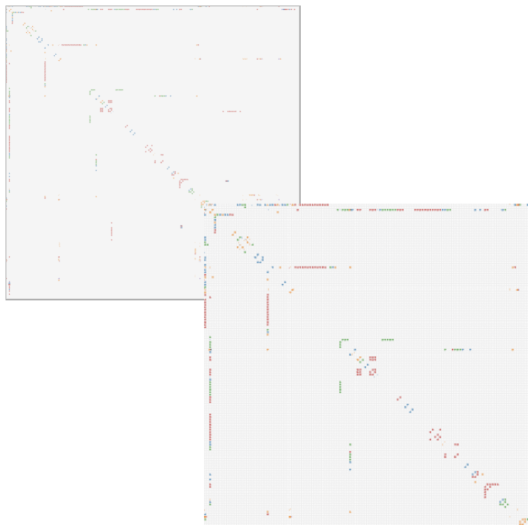

# Troubleshooting

If you experience technical issues or bug, please check this site or let us know which problems you encounter: (vistorian@inria.fr).

## Browser:
The Vistorian is optimized for Chrome. Through other browses might work well, e.g. Mozilla Firefox, visualizations might not show as expected as each browser interprets website a little differnetly. Chrome is small, fast, free, and runs on all major platforms: https://www.google.com/chrome.

 

## Matrix and Time Arcs shown offset: 

We have observed this on some Windows laptops, including Microsoft Surface. To solve this, go to Preferences/Settings (click the three dots in the top right of Chrome):

Then, set zoom to something smaller or higher than 100% (e.g. 67%, or 80%). Try different values and see if the matrix shows as below.

 
Your matrix should look like this with the labels clearly visible.

 

## Chrome Crashes: 
If Chrome crashes or the site is unresponsive for a while, the browser cache might be full. This can have two reasons:

* Your network is too large (> 5000 links), or
* You have too many networks and data imported into the Vistorian.

You have several ways to solve these issues:

* Remove networks and tables in your DataView. Click the x, next to the network(s) in the Network and Data Tables list: 

    

* If this doesn’t solve the problem, try the Empty browser cache button. This will flash the Vistorian’s browser cache. You will loose any data table and network imported into the Vistorian.