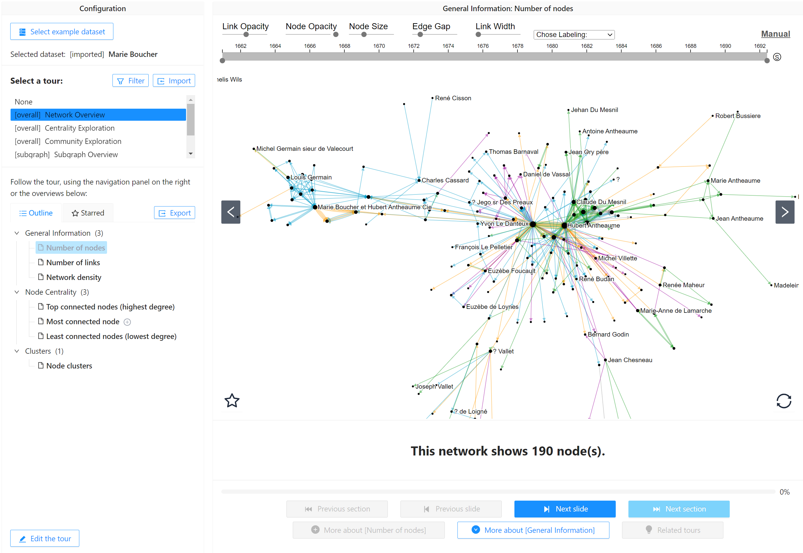

[Tours](networknarratives/tours) | [User Interface](networknarratives/userinterface)| [Help & Support](#help--support)

# Guided Tours with Network Narratives

NetworkNarratives is a Vistorian modules that provides a set of **automatically generated guided [tours](networknarratives/tours)** in the form of annotated [slideshows](#tours) to help you exploring your network. Chosing from a set of **[tours](networknarratives/tours)** (e.g., Network Overview, Egonetwork Exploration, etc.), NetworkNarratives creates a slideshow with text captions as if someone would give you talk about your network. With simple linear [navigation (next slide, previous slide)](networknarratives/userinterface.html#navigation-bar), you can navigate the slideshow and learn about your network.

## [>> Watch the video (3:29)](https://www.youtube.com/watch?v=qbbC131ZstM)

# Launching Network Narratives

You can launch NetworkNarratives direclty from The Vistorian side menu where you launch the individual visualizations. 

# Tours

A tour in Network Narratives is best imagined as a slide-deck. Each slide tells you something about your network. A tour consists of
* slides, showing a single fact about your network (e.g., the most connected node), and 
* sections, grouping slides of a specific topic (e.g., centrality measures). 

Slides in a tour are calculated by Network Narratives once a tour has been selected. 

You can use the [Navigation Bar](networknarratives/userinterface.html#navigation-bar) to navigate between slides. 

* Some slides propose **detours**, i.e., by including similar slides on demand, e.g., to learn more about a specific topic fact shown on a slide. 
* Other slides link to **related tours**, e.g., to learn more about the [ego network](networknarratives/tours.html#ego-network-exploration) of a node mentioned at that slide.

Find out which **[tours](networknarratives/tours)** Network Narratives provides with.

# User Interface

Learn more about the user interface **[here](networknarratives/userinterface)**.

# Help & Support 

[Get in touch](https://calendly.com/js-b/network-naratives-initial-interview?month=2022-03) to schedule a 1-1 session to help you get set with your data. A [Partcipant Information Sheet is optional if you would like to support our research and can be found here](https://docs.google.com/document/d/1t3eCX8xEGhfWX_dAsHZoTFMYa234VOZantDzy4R-RxE/edit?usp=sharing). 

