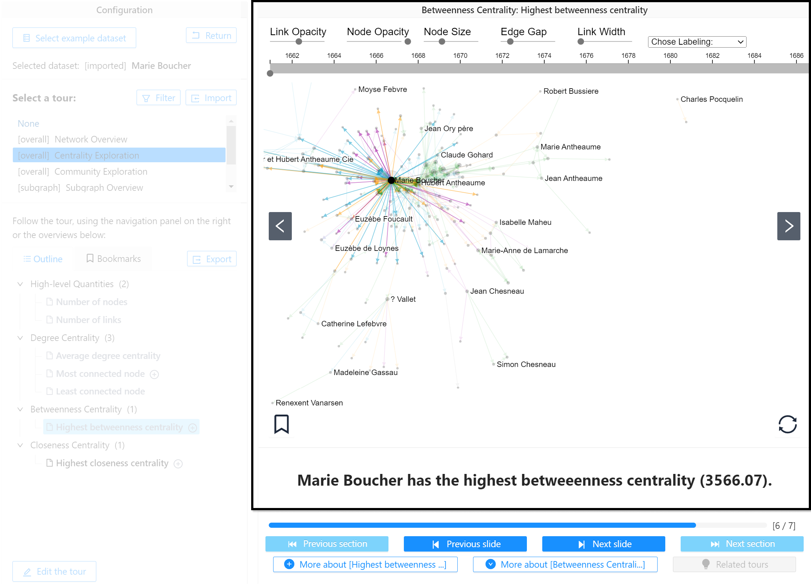
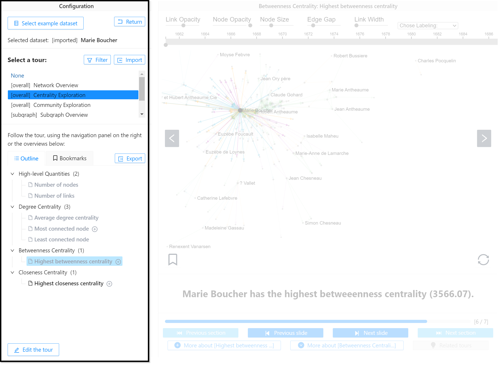

# Network Narratives User Interface

Network Narratives shows four different views, explained in the following

* **[Slide view (Visualizations and Captions)](#slide-view-visualization-and-captions)**
* **[Navigation Bar](#navigation-bar)**
* **[Tours Menu (Tours and Tour Overview)](#tours-menu)**

## Slide view: Visualization and Captions

The visualization view shows an interactive nodelink diagram of your network. During the tour, the visalization view remains fully interactive, allowing to hover nodes and pan and zoom. During the tour, Network Narratives will highlight nodes and links relevant to the current fact on your side.

* If your network has a time component, the visualization shows an interactive **time-range slider** on the top which you can use to set the visibility of nodes and links for specific time intervals.
* If your network has geographic information, **a map is shown with an overlaid nodelink diagram**. 
* The **gray arrows to the left and right of this view allow you to navigate** to the next and previous slides respectively.   
* You can **bookmark slides** you find important throug the small bookmark icon on the bottom left of the visualization view. 

Below the visualization view sit the **captions** explaining you what you see on this particular slide. 

## Navigation Bar

The navitation bar is the heart of the Network Narratives user interface and is best imagined as a **remove control**.. It helps you navigate between slides in your tour ("slide-deck") as well as sections. More info on the [structure of a tour can be found here](../networknarratives#tours).

* **A progress bar** indicates progress through the currently selected tour.
* **Previous slide:** brings you to the previous slide in your tour
* **Next slide:** brings you to the next slide in your tour
* **Previous section:** jumps to the previous section in the tour. A section is a collection of slides about a similar topic that helps structure the tour.
* **Next section:** jumps tpo the next section in your tour. A section is a collection of slides about a similar topic that helps structure the tour.
* **More about [...] (left button):** this button **will insert detailed slides related to the current slide** in your tour. Click this button if you want to learn about similar facts in your network as you see on the current slide. For example, if your current slide shows about _the most connected node_, clicking the button will insert slides into your tour to describe the 2nd and 3rd most connected node. 
* **More about [...] (right button):** this button will also insert **similar slides to the fact you currently see**. For exmaple, if your current slide is about _the most connected node_, clicking this button will show you more information about in-betweenness centrality.
* **Related tours:** shows you related to the tour you currently see.  
    
## Tours Menu

The tours menu allows you select among a range of [tours](tours) and see the [structure of the current tour](../networknarratives#tours). 

### Selecting tours

Some tours can be selected by default since they will explain you facts about the entire network. Other tours require 
* selecting a node (e.g., [Ego-network](tours@ego-network-exporation)), or 
* selecting a set of nodes, i.e., a subgraph (e.g., [Subgraph Exploration](tours/subgraph-exploration)) 

To select nodes, click a node or draw a lasso around a set of nodes in the [visualization view](#slide-view-visualization-and-captions).

### Tour overview and bookmarks.

The tour overview shows the tours sections and slides as a tree, as in a file browser. Sections group slides of similar content and help structure a tour. You can click each slide in the tour to directly jump to that slide or use the [navigation bar](#navigation-bar) to naviate through the slides in their linear sequence. 

A plus sign besides a tour indicated a _de-tour_, inserting similar slides to learn more about the fact shown at the respective slides (see also [Navigation Bar](#navigation-bar)). Newly inserted slides are addedd to your overview.  

If you click on the **Bookmarks tab**, you see a list of all [bookmarked slides](#slide-view-visualization-and-captions).

### Editing tours

You can edit tours, by adding and removing individual slides a well as filtering slides about specific facts you are most interested in, e.g., 
* geograpgy
* statistics
* weight
* density
* connectivity
* outliers
* node-neighbors
* overview

