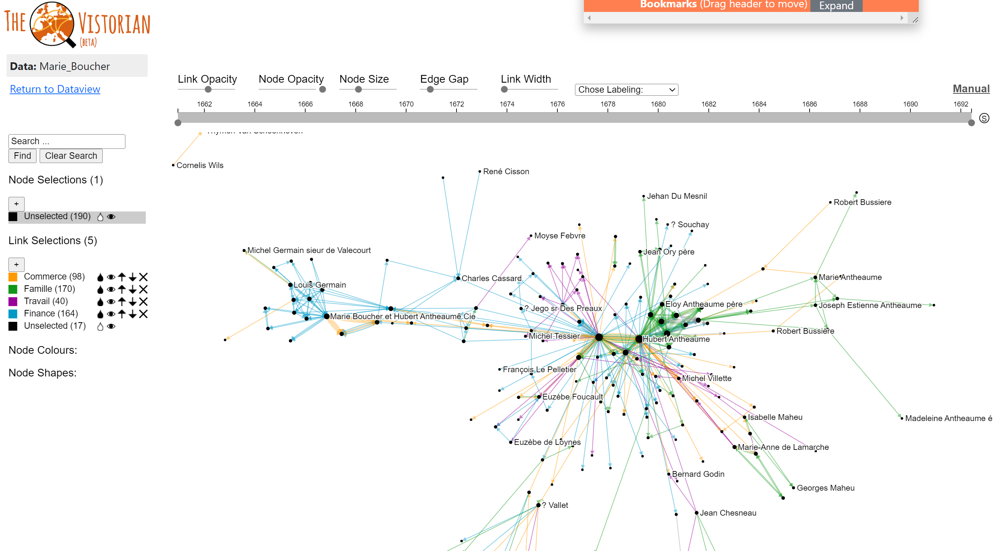
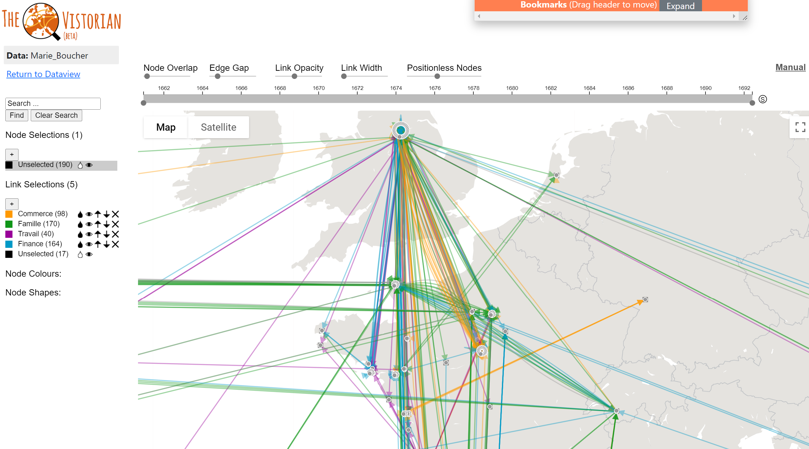

# The Vistorian in a Nutshell

**1/** The Vistorian is an open online application for the interactive exploration of multivariate, temporal, and geographical networks. 
  

  </img>

**2/** It can visualize
* link weight and direction
* node and link types
* temporal changes
* geography
  

**3/** The Vistorian provides four different interactive visualizations, each providing a complementary view onto your data
  

**4/** The **(1) Node Link Diagram** colors links by link type and their weight through line thinkness. It provides 
* interactive highlighting
* a time range slider to explore network evolution over time
* interactive filtering mechanisms,
* pan and zoom, and 
* interactive styling functions
  

**5/** The **(2) Adjacency Matrix** shows nodes in your network as rows and columns of a table while using table cells to show if two nodes are linked. Ordering of rows and columns in the matrix is algorithmically optimzed to reveal network structures as such clusters and highly connected nodes. 
  

**6/** The **(3) timeline** shows the evolution of a temporal network over time, layed out on a timeline from left to right. Rows in the view show the individual nodes in your network while links are shown as arcs between two rows at their respective time along the horizontal timeline. Clicking a node in a row shows the nodes immediate neighbors only, for clarity.
  

**7/** The **(4) map** shows nodes and linkes overlaid on a geographic map, if nodes have a geographic positions. An interactive slider can set a visual distance parameter to explore nodes with the same geographic locations.
  

**8/** All visualizations in the Vistorian are fully linked through brushing & linking, which highlights hovered nodes and links across any views. This features makes it possible to explore the same network using multiple complementary visualizations. 
  

**9/** The Vistorian is a stand-alone open source application. Your personal network data is kept safely in your browser's local storage. No account is required. No personal data is transmitted to our servers. 
  

**10/** Learn more on our blog and start your session today!
  

**11/** The Vistorian is developed by 
* The VisHub lab at The University of Edinburgh, UK
* Inria, FR
* Microsoft Research, Redmond, WA

