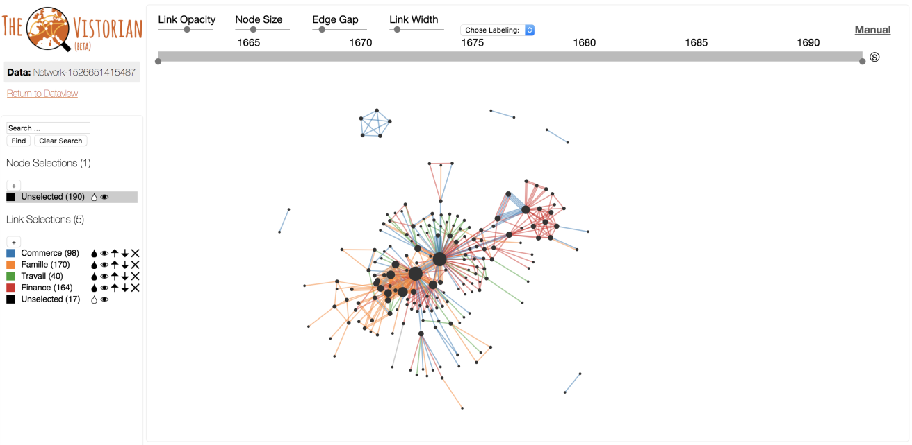
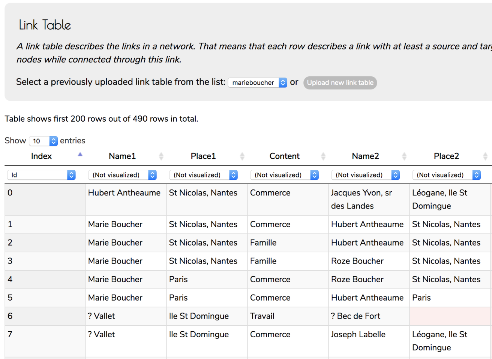
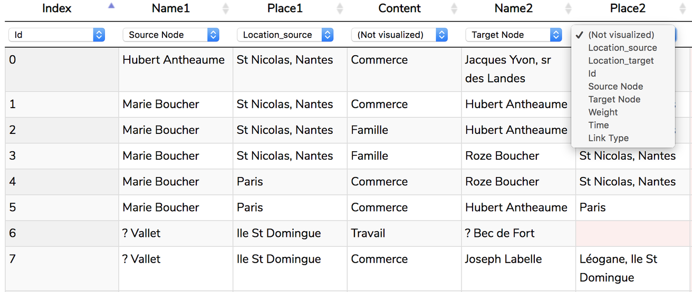
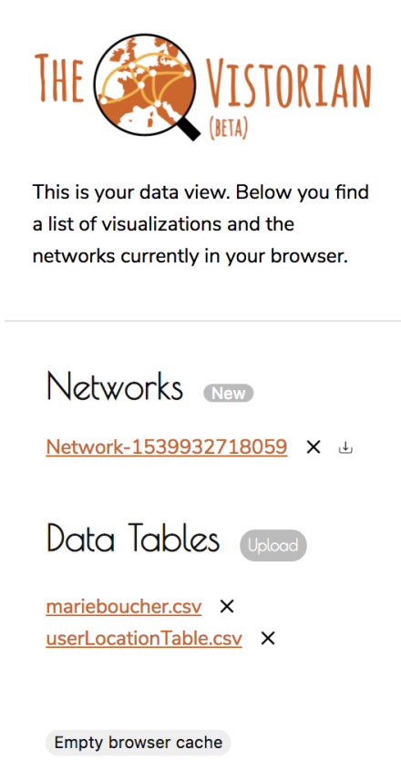

# Tutorials

## 1. Starting with the Tutorial 
1. Install Chrome: https://www.google.com/chrome. Vistorian will run on other browsers but we have not tested and optimized for other browsers.
2. Get the tutorial data [marieboucher.csv](  https://docs.google.com/spreadsheets/d/1sv2jakoxfNYPtqsQ5kI7SuzDBlW10xMwwiVSNVg2jD4/edit#gid=1326995075) or any other [demo data offered here](https://vistorian.github.io/gettingstarted.html/#demo-datasets).
3. Go to The Vistorian: http://vistorian.net
 
## 2. Loading Data
This small tutorial will walk explain how to load data and visualize them. The demo network (see below) is a social network based on letter correspondences. The following walks through:

* how the data is formatted
* How to import data, and
* how you can explore it using the various interactive visualizations

### Network representation of the data
The input data file marieboucher.csv is an edge list format. All files imported into Vistorian must be in csv format. This means that each row is representing an edge (or relationship) between a pair of nodes. 

Our file has the following columns:
* **Sender**: the node sending a letter
* **Location_sender**: the location the sending person was when writing the letter
* **Receiver**: the person receiving the letter
* **Location_recipient**: the location the receiving person was when receiving the letter
* **Qualification**: a type of letter, i.e. content.
* **Date**: the date the letter was written (sent).
 

Opening the file in google sheets or Excel shows the following:

For more information on data formatting and tables in Vistorian, see [here](https://vistorian.github.io/formattingdata.html).

 

### Import data
This section explains how to import (load) data into the Vistorian. The Vistorian will not upload any of your data onto any server. Instead, the data is stored in your browser and can be deleted by flashing the browser cache (https://www.technipages.com/google-chrome-clear-cache). Data is stored persistently for after reopening the browser and restarting your machine.

1. Open Google Chrome and get to http://vistorian.net

     

2. To explore a new network or continue with a previously imported one, click on ‘My Session’ at the top of the home page (symbol has changed).

    

3. A new tab will open in your browser with the Data view. This view is your main platform for managing your uploaded data. On the left you see two lists: networks and tables. The Network list contains your networks, the table list contains an entry for every data file you uploaded. (some networks can consist of more than two tables; and the same table can be used across several networks.). On the top, you see links to the respective visualizations.

    

4. To upload data for a new network, click the ‘new’ button next to the Network list. This will initiate an empty network. The text on the orange background tells you that your network is not ready for visualization yet. You also see two gray boxes labeled NodeTable and and LinkTable.

    

5. Since our demo data is in link table format, click no the ‘Upload new link table’ button and ignore the NodeTable box. Clicking the button opens a menu where you can select the downloaded marieboucher.csv file. Upon upload, the following table appears:
    

 

6. Now, you need to tell the Vistorian how to interpret that data. Therefore, select the corresponding meanings for each column from the dropdown menus above the columns:

    

    In this example, select the following mappings:

    * Sender -> **Source Node**
    * Location_sender -> **Location_source**
    * Qualification -> **Link Type**
    * Receiver -> **Target Node**
    * Location_receiver -> **Location_target**
    * Data -> **Time**

    When you assigning the Date field, Vistorian asks you to specify the time format used in the file. This demo file uses DD/MM/YYYY.

      

7. Making a network in The Vistorian is as simple as that. You will notice that the message at the top of this page which earlier was coloured orange is now coloured green, stating we are ready for looking at the data.
    

8. We can first choose to give our network a particular name if we wish by modifying the title in the ‘Name’ box at the top of the page and clicking ‘Save Network on the top right. Now, click on the Node Link and check if you see the network in the new tab that opens.
    

A new tab should open, showing the network like this:

## Extracting Geo-coordinates

This part will show you how to deal with geographic locations in the Vistorian. The demo network (see below) is a social network based on letter correspondences. The following walks through:

* how to extract geo-coordinates
* how to fix wrong coordinates
* how to save and load existing geo locations.

See here for how to [load data into the Vistorian](#2.-Loading-Data
).

### Extracting geolocations
This tutorial assumes that geolocations are encoded as additional columns in a [link table](/formattingdata.md). In this table, every line corresponds to a link with two locations: one for each node. The table uses column names Place1 and Place2, but you can name columns in your data as you like:

First, we tell the Vistorian which columns in our table are locations, and to which node they belong: select **Location_source** and **Location_target** from the respective dropdown menus.

Next, scroll down the bottom of the Data View page and you realize that the Vistorian has created a new table, containing an entry of each location entry it could find in your link table. 

This table contains the following field:

* **Id**: a unique internal identifier. You must not edit it.
* **User name**: this the location name you have specified in your link table. This field, too, must not be touched.
* **Geoname**: this is the official location name that will be send to the geo service to obtain the coordinates. At the beginning Vistorian will populate this column with the user names. However, as some location names in your may not correspond to currently existing locations known by the geoservice, you can change geonames (see below).
* **Longitude / Latidude**: geocoordinates.

### Obtaining geo-coordinates
Once you have your location table, click the ‘Update location coordinates‘ button in the gray area just above the table.

This will send your geonames to a [geoservice called Nominatim](https://nominatim.openstreetmap.org/ui/search.html) and populate the location table with coordinates where it could find the corresponding entries. Note that this time, one location has not been found: 

The problem here is that Ile St Domingue is the french name, while the geoservice needs english names. If you click into the geoname-field that says Ile St Domingue, change it to Santo Domingo and click again Update location coordinates. This will find the right coordinates.

### Solving ambiguous geonames
The demo data set contains some ambiguous location names such as Orléans (France, Canada) and Brest (France, Belarus). To solve ambiguity you can specify more information in the geoname column (don’t ever change the user name column as this will break your data set).

For example, for Orléans, write Orléans France, then click Update location coordinates. You will see that the coordinates have changed and that Orléans is now in France.

Of course, you can use the [map visualization](https://vistorian.github.io/visualizations.html/#map) to verify all your locations, then return to the data view, fix the coordinates, and reload the map visualization.

### Saving and using existing location tables
As creating clean and correct location tables can be tedious, you can export your table with the Export as CSV button at the right in the gray area.

To import an existing location table, chose Upload from the Vistorian menu, next to Data Tables (figure right). Select your csv and it will show under the Data Tables headline in the menu (e.g., userLocationTable.csv).

Next, specify the location fields in your link table (see above).

Last, chose that table in the Location Table drop down menu as shown below.

If you specify the location fields after selecting a location table, the Vistorian will create a new one. In this case, just re-select your original location table from the dropdown menu.

